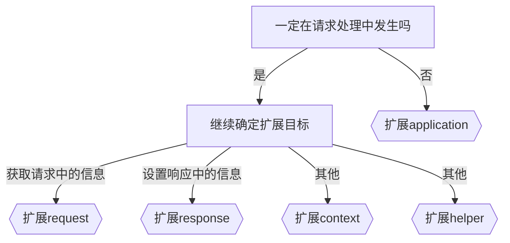

# egg

## 特点
1. 整合了后端技术，提供一站式开发体验
2. 制定了一套规范，统一了开发模式
3. 提供了各种插件，据类灵活的扩展能力
4. 约定优于配置
5. 内置多进程管理
6. 使用MVC模式

## 应用场景
- 中间服务器
- 纯后端服务器

## 创建egg工程
1. 使用egg脚手架
2. 手动搭建

```shell
npm i egg # 安装egg核心库
npm i -D egg-bin # 安装egg命令行工具
```

## 路由匹配

客户端 --> 服务器 --> egg路由匹配 --> 创建controller对象 --> 运行action --> 响应返回给客户端

## 路由较多？

不建议使用新建文件来区分router，可通过在router.js文件中新建router map来区分模块

## 控制器在子目录？

```js
// controller --> sub --> home --> index方法

// 以下两种方法读取都可
router.get('/', 'sub.home.index')
router.get('/', app.controller.sub.home.index)
```

## RESTful风格的URL定义

router提供了resources函数，用于定义RESTful风格的api接口

```js
router.resources('blogs', '/b', controller.blog)
```

上面一句代码的结果类似于

```js
router.get('blogs', '/b/', controller.blog.index)
router.get('new_blog', '/b/new', controller.blog.new)
router.get('blog', '/b/:id', controller.blog.show)
router.get('edit_blog', '/b/:id/edit', controller.blog.edit)
router.post('blogs', '/b', controller.blog.create)
router.put('blog', '/b/:id', controller.blog.update)
router.delete('blog', '/b/:id', controller.blog.destory)
```


## Controller和action

大部分情况下，对某个资源的处理，就对应一个Controller

在egg中，对Controller的要求如下
- 必须写到app/controller文件夹中
- 基类继承自Controller的类（非必填，但建议这样做）
- 文件名就是Controller的名称

当匹配到某个Controller，同时匹配到某个action时，egg会：
1. 创建Controller实例
2. 调用对应的action方法

## 静态资源

默认情况下，app/public目录为静态资源目录，请求路径`/public/*`中 * 位置对应的请求将被映射到app/public目录

egg之所以能够映射静态资源，是因为在内部使用了插件egg-static


## 插件

1. 命名 egg插件命名规范为 egg-*
2. 使用
```js
// /config/plugin.js

// 第一种写法
module.exports = {
  static: {
    // static -- 插件本身的名字
    enable: true, // 内置插件默认启用，第三方插件默认关闭
    package: 'egg-static', // 包名
    path: 插件的绝对路径，与package配置互斥
  }
}

// 第二种写法
exports.static = {
  enable: true,
  package: 'egg-static'
}

// 第三种写法
exports.static = true

```
3. 配置
`config/plugin.js`只是控制插件的启用和关闭，对于插件的配置需要在`config/config.default.js`中完成

这样做的逻辑理念是：集中配置，集中管理

不同的插件有不同的配置，需要阅读插件的官方文档

```js
exports.static = {
  // egg-static的配置
}
```


## 中间服务器

- 常见职责
 
代替传统后端服务器，托管静态资源，动态渲染页面，提供少量api访问

托管单页应用程序的静态资源，提供各种数据api

## 模板引擎

如果要使用传统的方式进行服务端渲染，就需要用到模板引擎

egg内置了插件egg-view，它本身不是模板引擎，但它可以对不同的模板引擎统一配置、统一处理

需要安装具体的模板引擎引擎插件，完成模板引擎的启用

### 安装

egg-view支持多种模板引擎，用的较多的是egg-view-nunjucks和egg-view-ejs

```shell
npm install egg-view-ejs
```

### 启用模板引擎插件

```js
// config/plugin.js
exports.ejs = {
  enable: true,
  package: 'egg-view-ejs'
}

// config/config.default.js
exports.view = {
  // root: '', // 渲染的文件所在目录，默认是app/view/*
  // cache: true, // 默认开启缓存 
  mapping: {
    '.ejs': 'ejs',
    '.html': 'ejs',
  },
  defaultViewEngine: 'ejs', // 如果mapping找不到对应的模板引擎，将使用该值作为默认的模板引擎
  defaultExtension: '.ejs' // 后续在controller中渲染模板时，默认渲染模板的后缀名
}
```

### 渲染页面

配置好模板引擎后，即可在`app/view`中书写各种模板

当某个请求到达后，如果需要经过模板渲染页面，只需要在action中使用对应代码即可

```js
render(name, model) // 渲染模板文件，并赋值给body
renderView(name, model) // 渲染模板文件，不会赋值给body
renderString(tpl, model) // 渲染模板字符串，不会赋值给body
```

此时已经形成完整的MVC模式  Model(数据源) View（视图，模板文件） Controller（控制器，将数据赋值给模板操作）

## 编写中间件

### 全局中间件

```js
// app/middleware/mymid.js
module.exports = (options, app) => {
  return async function (ctx, next) {
    console.log('中间件开始', options);
    await next()
    console.log('中间件结束', options);
  }
}


// config/config.default.js
// 导出所有中间件
exports.middleware = ['mymid']

// 单独配置某个中间件
exports.mymid = {
  enable: true, // 通用配置，默认为true
  match: <string | regExp | function>,
  ignore: <string | regExp | function>,
  a: 1,
  b: 2
}
```

enable\match\ignore 为通用配置，每个中间件都有

enable: boolean 是否启用中间件

match和ignore -- 分别标识匹配和忽略，它们均支持多种类型的配置方式
- 字符串：配置的是一个url的路径前缀，所有以配置的字符串作为前缀的url都会匹配上。也可以直接使用字符串数组
- 正则：当参数为正则时，直接匹配满足正则验证的url的路径
- 函数：会将请求上下文传递给这个函数，最终取函数返回的结果（true/false）来判断是否匹配


### 路由中间件

```js
// app/router.js
module.exports = app => {
  const { router } = app
  const verifyToken = app.middleware.verifyToken({}, app)

  router.get('/', verifyToken, xxx, yyy, 'home.index') // 路由中间件可以写多个，依次写入即可
  router.get('/login', 'user.login')
  router.post('/login', 'user.handleLogin')
}
```

### 内置中间件

egg提供了一些内置的中间件，可通过app.config.coreMiddlewares查看

这些内置中间件将会和自定义的中间件配置合并，最终形成一个真正的中间件函数数组：app.middleware,真正起作用的是该数组中的函数

```js
// 内置中间件输出结果
[
  'meta',
  'siteFile',
  'notfound',
  'static',
  'bodyParser',
  'overrideMethod',
  'session',
  'securities',
  'i18n',
  'eggLoaderTrace'
]
```

## 通用模型提取

### 全局通用模型

配置在app.js文件中，添加到app.locals对象中
```js
// app.js
module.exports = (app) => {
  app.locals = {
    globalTitle: '地区数据库'
  }
  app.axios = require('axios').default
}

// app/view/common/header.ejs
<title><%= title %> - <%= globalTitle %></title>
```

### 上下文通用模型

放到ctx.locals中，通常在中间件中设置

### 局部模型

一般在具体的action中设置


## 三层架构 + MVC

### 三层架构


## 环境配置

### 两种配置方式

1. 通过`config/env`文件指定 -- 不推荐，服务器部署之后还要改动这个文件
2. 推荐通过`EGG_SERVER_ENV`环境变量指定运行环境更加方便，比如在生产环境启动应用：
```js
EGG_SERVER_ENV = prod npm start
```

### 获取运行环境

提供变量 `app.config.env` 来表示应用当前的运行环境

若没有指定 `config/env` 文件，同时也没有指定 `EGG_SERVER_ENV` 环境变量，`app.config.env`的值由 `NODE_ENV` 确定

- NODE_ENV没有设置或者设置了识别不出的值，那么`EGG_SERVER_ENV`为local  -- 本地开发环境
- NODE_ENV值为test，那么`EGG_SERVER_ENV`为unittest  -- 单元测试
- NODE_ENV值为production，那么`EGG_SERVER_ENV`为prod  -- 生产环境


### 针对环境的配置

```
config
|- config.default.js
|- config.prod.js
|- config.unittest.js
|- config.local.js
```

config.default.js 为默认的配置文件，所有环境都会加载这个配置文件，一般也会作为开发环境的默认配置文件

当指定 env 时会同时加载对应的配置文件，并覆盖默认配置文件的同名配置

```js
// config/config.default.js
exports.cluster = {
  listen: {
    port: 7001,
  },
};

// config/config.prod.js
exports.cluster = {
  listen: {
    port: 5000,
  },
};
```

支持自定义环境变量,配置相应的config文件即可
```js
// package.json
{
	"scripts":{
		"dev": "EGG_SERVER_ENV=yuanjin egg-bin dev"
	}
}

// config/config.yuanjin.js
exports.cluster = {
  listen: {
    port: 6000,
  },
};
```

## 部署

传统的nodejs部署需要pm2来管理进程，因为需要开启多个子进程来做其他事情，比方说捕获异常等，不会因为异常而终止运行

### egg-cluster

egg内置了一个插件 `egg-cluster`，它的作用是在egg启动时，启动多个子进程

因此，egg实际上是运行在多个进程上的应用，这些进程的职责分别为：

- 主进程：Master进程，稳定性极高的进程。主要负责管理其他进程
- worker进程：由主进程开启，通常情况下数量和cpu的核数保持一致。worker进程是真正用于处理请求的进程。某次请求具体交给哪个worker进程来处理由主进程调度
- Agent进程：由主进程在启动后开启，只有一个，相当于其他进程的秘书，通常用于做各种脏活累活，比如维持一个长连接。agent进程通常对开发者是隐形的，平时不会接触它

### egg-scripts

1. 安装
```shell
npm i egg-scripts
```
2. 配置脚本
```json
{
  "scripts": {
    "start": "egg-scripts start --daemon",
    "stop": "egg-scripts stop"
  }
}
```
3. 运行
```shell
npm start # 启动
npm run stop # 停止
```

启动命令中支持以下参数：

- --title=name，设置应用全名，默认为egg-server-${APP_NAME}

  - 在停止时，建议指定停止的egg应用名称，否则，如果服务器运行了多个egg应用，将会停止所有的egg应用

      ```shell
        egg-scripts stop --title=myegg-server
      ```

- --port=7001 端口号，默认会读取环境变量 process.env.PORT，如未传递将使用框架内置端口 7001。

- --daemon 是否允许以守护进程的模式运行。

- --env=prod 框架运行环境，默认会读取环境变量 process.env.EGG_SERVER_ENV， 如未传递将使用框架内置环境 prod。

- --workers=2 框架 worker 线程数，默认会创建和 CPU 核数相当的 app worker 数，可以充分的利用 CPU 资源。

- --https.key 指定 HTTPS 所需密钥文件的完整路径。

- --https.cert 指定 HTTPS 所需证书文件的完整路径。


## 编写定时任务

- 定期更新缓存
- 定期删除一些不再使用的文件
- 定期检查数据库，删除无意义的数据
- 定期爬取一些数据，保存到数据库
- 等等

只需要在app/schedule文件夹中编写各种任务即可

egg启动后，会读取文件夹中的所有模块，把它们的导出当做任务定期执行

1. 方式1

```js
// app/schedule/cacheLocals
const Subscription = require("egg").Subscription;

module.exports = class extends Subscription {
  // 通过 schedule 属性来设置定时任务的执行间隔等配置
  static get schedule() {
    return {
      interval: "1m", // 1 分钟间隔
      type: "all", // 指定所有的 worker 都需要执行
    };
  }

  // subscribe 是真正定时任务执行时被运行的函数
  async subscribe() {
    console.log("更新缓存");
    const key = "province";
    const resp = await this.app.axios.get(`${this.config.$apiBase}/api/local`);
    //缓存
    this.app.redis.set(key, JSON.stringify(resp.data));
  }
};
```

2. 方式2

```js
module.exports = {
  schedule: {
    interval: '1m', // 1 分钟间隔
    type: 'all', // 指定所有的 worker 都需要执行
  },
  async task(ctx) { // task 是真正定时任务执行时被运行的函数
    console.log("更新缓存");
    const key = "province";
    const resp = await ctx.app.axios.get(`${ctx.app.config.$apiBase}/api/local`);
    //缓存
    ctx.app.redis.set(key, JSON.stringify(resp.data));
  },
}
```
### schedule配置

无论使用哪一种方式，都必须提供`schedule`属性来配置任务

- `interval`：字符串，描述任务执行的间隔时间。参考：https://github.com/vercel/ms

- `cron`：字符串，任务执行的契机，它和`interval`设置一个即可。

  参考：https://github.com/harrisiirak/cron-parser

  在线生成器：https://cron.qqe2.com/

  ```js
  "* */3 * * * * "  // 每隔3分钟执行一次
  "0 0 0 * * 3" // 每周3的凌晨执行一次
  "0 0 0 24 12 *" // 每年圣诞节执行一次
  ```

- `type`，任务类型，支持两种配置：

  - `worker`，只有一个 worker 会执行这个定时任务，每次执行定时任务的 worker 的选择是随机的
  - `all`，每个 worker 都会执行这个定时任务。

- `immediate`，如果设置为`true`，应用启动时会立即执行该任务

- `env`，数组，只有在指定的环境中才会启动该任务

- `disable`，一个开关，表示任务是否被禁用

> 更多关于任务的操作参考：https://eggjs.org/zh-cn/basics/schedule.html


## 日志

egg在内部使用egg-logger插件完成日志记录

### 日志路径

默认情况下，日志保存在 logs/工程名 中

可以通过下面的配置自定义日志路径

```js
// config/config.default.js
// 建议根据不同的环境来配置不同的日志路径
const path = require('path')
exports.logger = {
  dir: path.resolve(__dirname, '../logs') // 采用自定义路径
}
```

egg的内置日志分为下面几类，通过相关api即可完成日志记录

|    类别    |    输出目标    |        含义         |                api                 |
| :--------- | :------------- | :------------------ | :--------------------------------- |
| **appLogger** | **项目名-web.log** | **应用相关日志** |   **ctx.logger<br />app.logger**   |
| coreLogger |  egg-web.log   | 框架内核、插件日志  | ctx.coreLogger<br>app.coreLogger |
| errorLogger | common-error.log | error级别的日志均会记录到这里 | 详见日志级别 |
| agentLogger | egg-agent.log | agent的进程日志 | agent.logger |

无论使用哪个`api`记录日志，都会有对应的**日志级别**，分别是

```js
日志对象.debug("some info"); // 记录调试信息
日志对象.info("some info"); // 记录普通信息
日志对象.warn("some info"); // 记录警告信息
日志对象.error(new Error("some info")); // 记录错误信息，应该使用错误对象，否则无法得到堆栈信息
```

### 自定义日志

```js
// 配置文件
// 配置自定义日志类别
exports.customLogger = {
  myLogger: { // 属性名为类别名称
    file: path.resolve(__dirname, "../logs/my-logger.log"), // 配置日志文件
    // 配置哪些级别及其以上的日志要被记录到日志文件，设置为NONE则会关闭日志记录，默认为 INFO
    level: 'DEBUG', 
    // 配置哪些级别及其以上的日志要被打印到控制台，设置为NONE则会关闭日志记录，默认为 INFO
    consoleLevel: 'DEBUG',
    // 配置日志文件的编码，默认为 utf-8
    encoding: 'gbk',
    // 是否使用json格式记录日志，默认为false
    outputJSON: true,
    // app logger
    formatter(meta) {
        return `[${meta.date}] ${meta.message}`;
    },
    // ctx logger
    contextFormatter(meta) {
      return `[${meta.date}] [${meta.ctx.method} ${meta.ctx.url}] ${meta.message}`;
    },
  }
}
```

记录自定义日志：

```js
app.getLogger('myLogger') // 获取全局应用日志对象
ctx.getLogger('myLogger') // 获取上下文日志对象
```

> schedule的日志就是一个自定义日志，日志类别名为`scheduleLogger`

> 更多日志的功能参考：https://eggjs.org/zh-cn/core/logger.html\


## 使用session

## 异常处理

### 使用koa的异常处理模式
```js
// app.js
module.exports = (app) => {
  app.on("error", (err, ctx) => { // 和 koa 的异常处理类似
    console.log(err, ctx);
  });
};
```

### 使用egg的异常处理模式

为了更方便的处理常见的应用场景，egg内部使用了`egg-onerror`插件来处理异常

默认情况下，`egg-onerror`会对异常做出以下处理

```js
// config/config.default.js
exports.onerror = { // 配置 egg-onerror 插件
  errorPageUrl: '/error',// 线上页面发生异常时，重定向到这个地址
  all(err, ctx) {
    // 在此处定义针对所有响应类型的错误处理方法
    // 注意，定义了 config.all 之后，其他错误处理方法不会再生效
    ctx.body = 'error';
    ctx.status = 500;
  },
  html(err, ctx) {
    // html hander
    ctx.body = '<h3>error</h3>';
    ctx.status = 500;
  },
  json(err, ctx) {
    // json hander
    ctx.body = { message: 'error' };
    ctx.status = 500;
  }
};
```

框架支持通过配置，将默认的 HTML 请求的 404 响应重定向到指定的页面。

```js
// config/config.default.js
exports.notfound = {
  pageUrl: '/404',
};
```

## 其余功能

- [文件上传](https://eggjs.org/zh-cn/basics/controller.html#获取上传的文件)
- [国际化I18n](https://eggjs.org/zh-cn/core/i18n.html)
- [helper对象](https://eggjs.org/zh-cn/basics/objects.html#helper)
- [验证](https://eggjs.org/zh-cn/basics/controller.html#参数校验)


## 框架扩展

- application， `app/extend/application.js`
- context， `app/extend/context.js`
- request，`app/extend/request.js`
- response，`app/extend/response.js`
- helper，`app/extend/helper.js`


### 扩展决策树

mermaid能绘制哪些图？

- 饼状图：使用pie关键字，具体用法后文将详细介绍
- 流程图：使用graph关键字，具体用法后文将详细介绍
- 序列图：使用sequenceDiagram关键字
- 甘特图：使用gantt关键字
- 类图：使用classDiagram关键字
- 状态图：使用stateDiagram关键字
- 用户旅程图：使用journey关键字



